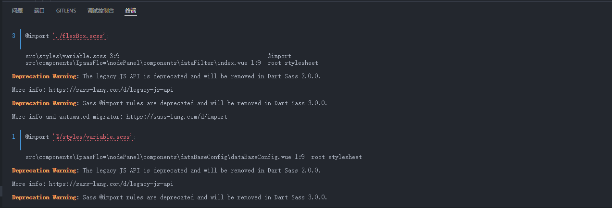
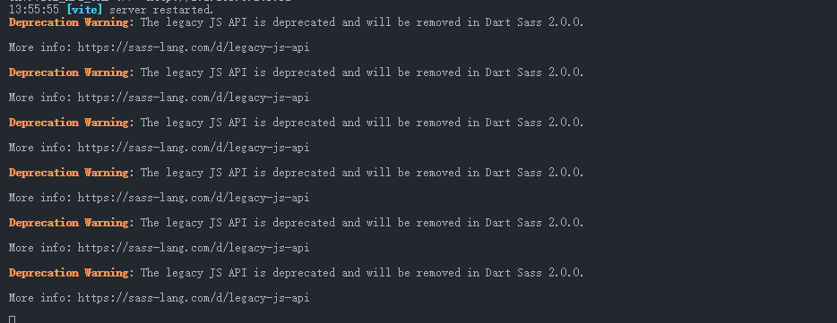

# 问题和技巧

### 使用css为一个容器添加边框，但不影响其大小和周围布局
- 阴影
- 伪元素 
  - `::before`
  - `::after`

### 使用预处理器 sass 时出现的问题
- 处理报错
 


```js
// vite.config.js
	css: {
			preprocessorOptions: {
				scss: {
					silenceDeprecations: ['import'],
					additionalData: `@import '@/styles/variable.scss';`,
				},
			},
		},
```
- 处理警告
 


```js
// vite.config.js
	css: {
			preprocessorOptions: {
				scss: {
					// api: 'modern-compiler',
					silenceDeprecations: ['legacy-js-api', 'import'],
					additionalData: `@import '@/styles/variable.scss';`,
				},
			},
		},
```