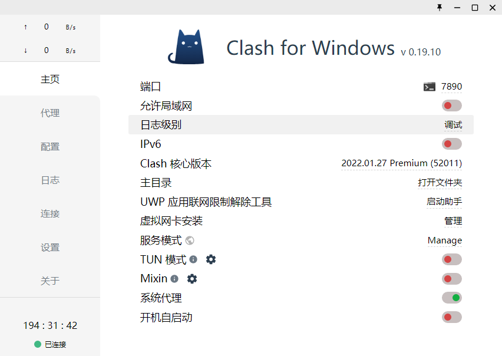
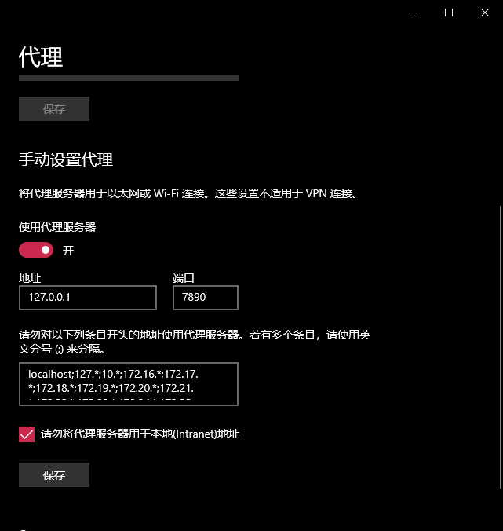

#### 问题一：<font color=red>'HTTP/2 stream 1 was not closed cleanly before end of the underlying stream'</font>

- git 默认使用的通信协议出现了问题，可以通过将默认通信协议修改为 http/1.1 来解决该问题。

  ```shell
  $ git config --global http.version HTTP/1.1
  ```

#### 问题二：<font color=red>'Failed to connect to github.com port 443 解决方案'</font>

- 使用自己的 vpn ，通过配置 http[s] 代理

  ```shell
  $ git config --global http.proxy 127.0.0.1:7890
  $ git config --global https.proxy 127.0.0.1:7890
  ```

- 配置的代理 ip 和 vpn 上使用的一致
  
  

- 查看代理命令

  ```shell
  $ git config --global --get http.proxy
  $ git config --global --get https.proxy
  ```

- 取消代理命令

  ```shell
  $ git config --global --unset http.proxy
  $ git config --global --unset https.proxy
  ```
