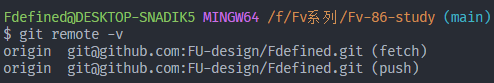
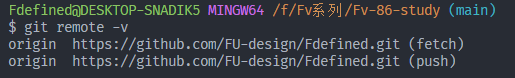

- 查看当前与远程仓库的关联方式

  ```shell
  $ git remote -v
  ```

  - 以 <font color=red>SSH</font> 方式 clone 的远程仓库
    
  - 以 <font color=red>HTTPS</font> 方式 clone 的远程仓库
    

- 移除当前本地关联的远程仓库

  ```shell
  $ git remote remove origin
  ```

- 本地代码关联远程仓库

  ```shell
  $ git remote add origin [https | ssh]
  ```
