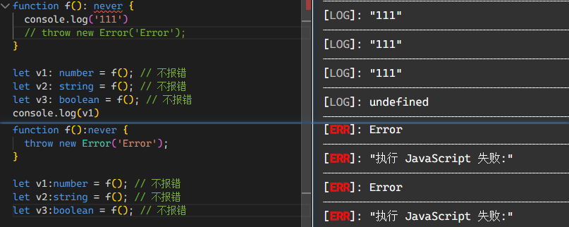

#### any 类型 (顶层类型)

- 定义： **any** 类型表示没有任何限制，该类型的变量可以赋予任意类型的值（和动态类型判断一样）。

- 特点：

  - 声明变量的时候，没有指定为任意一种类型，则会默认该参数类型为 **any**
  - 若使用 **any** 就失去了使用 typescript 的类型校验意义
  - 可以给类型为 **any** 的变量，赋值任何类型的值

#### unknown 类型 (顶层类型)

- 定义：和 **any** 类型一样，表名类型不确定性

- 特点：（与 **any** 的区别）

  - **unknown** 可以定义任何类型的值

    ```js
    let value: unknown;

    value = true; // OK
    value = 42; // OK
    value = "Hello World"; // OK
    value = []; // OK
    value = {}; // OK
    value = null; // OK
    value = undefined; // OK
    value = Symbol("type"); // OK
    ```

  - **unknown** 类型的变量，不能直接赋值给其他类型的变量（除了 **any** 类型和 **unknown** 类型）

    ```js
    let uname: unknown = "admin";
    let name: string = uname; // error
    ```

  - **unknown** 可赋值对象只有 unknown 和 any

    ```js
    let uname: unknown = "admin";
    let name: any = uname; // OK
    ```

  - **unknown** 类型的对象，无法调用对象中的属性和方法，**any** 可以

    ```js
    let obj: any = { b: 1 };
    obj.a; // OK

    let obj: unknown = { b: 1, ccc: (): number => 213 };
    obj.b; // error
    obj.ccc(); // error
    ```

  - **unknown** 类型变量能够进行的运算是有限的，只能进行比较运算（运算符==、===、!=、!==、||、&&、?）、取反运算（运算符!）、typeof 运算符和 instanceof 运算符这几种，其他运算都会报错

- 类型缩小（即将一个不确定的类型缩小为更明确的类型。）

  ```js
  let a: unknown = 1;

  if (typeof a === "number") {
    let r = a + 10; // 正确
  }
  ```

#### never 类型 (底层类型)

- 定义：即该类型为空，不包含任何值
- 特点：**never** 类型的一个重要特点是，可以赋值给任意其他类型，返回的必须是一个。

  ```js
  function f(): never {
    throw new Error("Error");
  }

  // 但不会继续执行
  let v1: number = f(); // 不报错
  let v2: string = f(); // 不报错
  let v3: boolean = f(); // 不报错
  ```

  以下方式，never 类型会出现红色波浪线，但代码会继续运行：

  ```js
  function f(): never {
    console.log("111");
    // throw new Error('Error');
  }

  let v1: number = f(); // 不报错
  let v2: string = f(); // 不报错
  let v3: boolean = f(); // 不报错
  console.log(v1);
  ```

  

- 不太理解：
  > 为什么 **never** 类型可以赋值给任意其他类型呢？这也跟集合论有关，空集是任何集合的子集。TypeScript 就相应规定，任何类型都包含了 **never** 类型。因此，**never** 类型是任何其他类型所共有的，TypeScript 把这种情况称为“底层类型”（bottom type）。
