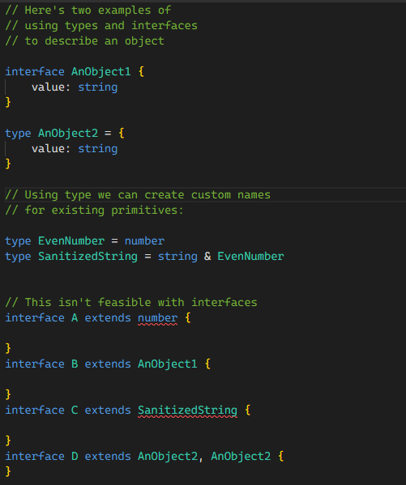

# 常见类型

##### 可选属性（Optional Properties）`属性名?`

```ts
function printName(obj: { first: string; last?: string }) {
// Error - might crash if 'obj.last' wasn't provided!
console.log(obj.last.toUpperCase());
 'obj.last' is possibly 'undefined'.
 if (obj.last !== undefined) {
     // OK
     console.log(obj.last.toUpperCase());
 }

 // A safe alternative using modern JavaScript syntax:
 console.log(obj.last?.toUpperCase());
 }
```

#### 联合类型（Union Types） `属性名: 类型1 | 类型2 | ...`

```ts
function welcomePeople(x: string[] | string) {
  if (Array.isArray(x)) {
    // Here: 'x' is 'string[]'
    console.log('Hello, ' + x.join(' and '));
  } else {
    // Here: 'x' is 'string'
    console.log('Welcome lone traveler ' + x);
  }
}
```

#### 类型别名（Type Aliases）`type 类型名 = 各种类型`

```ts
type Point = {
  x: number;
  y: number;
};

type ID = number | string;

type UserInputSanitizedString = string;
function sanitizeInput(str: string): UserInputSanitizedString {
  return sanitize(str);
}
```

#### 接口（Interfaces）`interface {...各种类型}`

```ts
interface Point {
  x: number;
  y: number;
}

function printCoord(pt: Point) {
  console.log("The coordinate's x value is " + pt.x);
  console.log("The coordinate's y value is " + pt.y);
}

printCoord({ x: 100, y: 100 });
```

> Differences Between Type Aliases and Interfaces

1.  继承方式不同

    ```ts
    interface Animal {                |      type Animal = {
        name: string;                 |        name: string;
    }                                 |      }
                                      |
    interface Bear extends Animal {   |      type Bear = Animal & {
        honey: boolean;               |        honey: boolean;
    }                                 |      }
                                      |
    const bear = getBear();           |      const bear = getBear();
    bear.name;                        |      bear.name;
    bear.honey;                       |      bear.honey;
    ```

2.  类型别名可能不参与声明合并，但接口可以。

    ```ts
      interface Animal {                |      type Animal = {
          name: string;                 |        name: string;
      }                                 |      }
                                        |
      interface Animal {                |      type Animal {
          honey: boolean;               |        honey: boolean;
      }                                 |      }
                                        |
      const animal = Animal();          | // 报错：不能重复声明 'Animal'
      animal.name;                      |
      animal.honey;                     |
    ```

3.  接口只能用于声明对象的类型，而不能重命名基本类型

    > <font color=red> An interface can only extend an object type or intersection of object types with statically known members.</font>
    > 接口只能扩展对象类型或对象类型与静态已知成员的交集
    > 

4.  接口名称将始终以其原始形式出现在错误消息中，但仅限于按名称使用时。
5.  如果您想要启发式方法，请使用接口，直到您需要使用类型中的功能。

#### 类型断言（Type Assertions）`变量 as 类型`

```ts
const myCanvas = document.getElementById('main_canvas') as HTMLCanvasElement;
// 或
const myCanvas = <HTMLCanvasElement>document.getElementById('main_canvas');
```

> TypeScript 只允许类型断言转换为更具体或不太具体的类型版本。该规则可以防止“不可能”的强制，例如：
>
> ```ts
> const x = 'hello' as number;
> ```
>
> // error: Conversion of type 'string' to type 'number' may be a mistake because neither type sufficiently overlaps with the other. If this was intentional, convert the expression to 'unknown' first
> 将“字符串”类型转换为“数字”类型可能是一个错误，因为这两种类型都没有充分重叠,ps 与另一个。如果这是故意的，请先将表达式转换为“未知”

#### 字面类型（Literal Types）

<font color=red>
// error： Type '"howdy"' is not assignable to type '"hello"'.
</font>
类型“howdy”不可分配给类型“hello”

```ts
let x: 'hello' = 'hello';
// OK
x = 'hello';
// error
x = 'howdy';
```

- 和非文字类型组成联合类型
  <font color=red>
  // error： Argument of type '"automatic"' is not assignable to parameter of type 'Options | "auto"'..
  </font>
  “automatic”参数的类型不能不可分配给 “Options | auto ” 类型作为参数。

  ```ts
  interface Options {
    width: number;
  }
  function configure(x: Options | 'auto') {
    // ...
  }
  configure({ width: 100 });
  configure('auto');

  // error
  configure('automatic');
  ```

- 字面推理

  ```ts
  declare function handleRequest(url: string, method: "GET" | "POST"): void;

  const req = { url: "https://example.com", method: "GET" };

  //error  Argument of type 'string' is not assignable to parameter of type '"GET" | "POST"'.
  handleRequest(req.url, req.method);


  <!-- 使用类型断言修改 -->
    // Change 1:
    const req = { url: "https://example.com", method: "GET" as "GET" };
    // Change 2
    handleRequest(req.url, req.method as "GET");

  <!-- 使用常量断言 -->
    const req = { url: "https://example.com", method: "GET" } as const;
    handleRequest(req.url, req.method);
  ```
