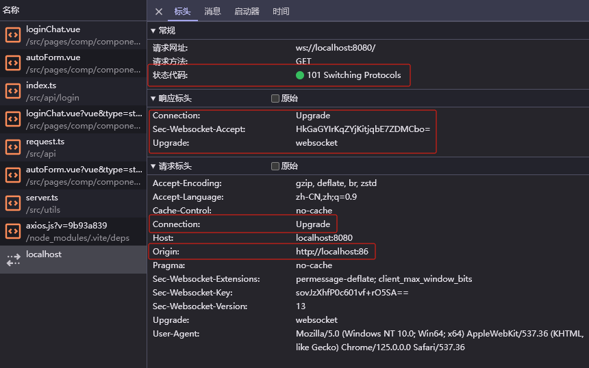

## websocket 的基本使用（HTML5）

1. 创建 websocket 实例
   ```ts
   const ws: WebSocket = new WebSocket("ws://localhost:8080");
   ```
2. 通过 websocket 实例的 4 个主要事件来控制通讯过程

   - `open`：监听是否连接到 websocket 服务器
   - `message`：监听接收到从 websocket 服务器传递回来的消息
   - `close`：监听是否与 websocket 服务器断开连接
   - `error`：监听与 websocket 服务器连接过程中出现的连接错误信息

3. 具体代码示例

   ```ts
   let ws: WebSocket;
   const connectWebSocket = () => {
     ws = new WebSocket("ws://localhost:8080");

     // 监听打开事件
     ws.onopen = (event) => {
       console.log("连接到WebSocket服务器", event);
     };

     // 监听消息事件
     ws.onmessage = (event) => {
       const recevice = event.data as string;
       console.log("接收到的消息" + JSON.parse(recevice));
     };

     // 监听关闭事件
     ws.onclose = (event) => {
       console.log("断开与WebSocket服务器的连接", event);
     };

     // 监听错误事件
     ws.onerror = (error) => {
       console.error("WebSocket错误:", error);
     };
   };
   ```

#### WebSocket 事件（event）

1. `open` ...
2. `error` 事件触发后，紧接着就是触发 close 事件。
3. `message` 事件在服务器发送讯息时触发。服务端向客户端发送的信息可包含: 纯文本信息（string）二进制数据（ArrayBuffer）或图像，一次仅支持一种二进制格式。

   - 接收信息类型处理（服务器都以字符串的形式进行响应，然后在客户端进行解析）

     - String
     - JSON
     - XML
     - ArrayBuffer（数组缓冲区）

       ```js
       socket.onmessage = function(event) {
         if(event.data instanceof ArrayBuffer ){
             var buffer = event.data;
             console.log(“Received arraybuffer”);
         }
       }
       ```

4. `close` 事件标志着服务器和客户端之间通信的结束，除非重新连接，否则无法再次交换任何信息（可能出现网络或其他不良因素触发关闭事件）

在前端使用 WebSocket 时，查看连接状态是确保实时通信正常工作的关键步骤。WebSocket 对象提供了一些属性和事件，可以帮助你监控连接状态。

#### WebSocket 连接状态（status）

WebSocket 对象有一个`readyState`属性，它表示 WebSocket 连接的当前状态。`readyState`可以有以下几个值：

- `0 (WebSocket.CONNECTING)`：正在建立连接。
- `1 (WebSocket.OPEN)`：连接已建立，可以进行通信。
- `2 (WebSocket.CLOSING)`：连接正在关闭。
- `3 (WebSocket.CLOSED)`：连接已关闭或无法建立。

##### 示例：监控 WebSocket 连接状态

创建 WebSocket 连接并监控其状态：

```javascript
// 创建WebSocket连接
const socket = new WebSocket("wss://example.com/socket");

// 监听连接打开事件
socket.addEventListener("open", (event) => {
  console.log("WebSocket is open now.");
  checkConnectionStatus();
});

// 监听连接关闭事件
socket.addEventListener("close", (event) => {
  console.log("WebSocket is closed now.");
  checkConnectionStatus();
});

// 监听连接错误事件
socket.addEventListener("error", (event) => {
  console.error("WebSocket error observed:", event);
  checkConnectionStatus();
});

// 监听消息事件
socket.addEventListener("message", (event) => {
  console.log("Message from server:", event.data);
});

// 检查WebSocket连接状态
function checkConnectionStatus() {
  switch (socket.readyState) {
    case WebSocket.CONNECTING:
      console.log("WebSocket is connecting...");
      break;
    case WebSocket.OPEN:
      console.log("WebSocket is open.");
      break;
    case WebSocket.CLOSING:
      console.log("WebSocket is closing...");
      break;
    case WebSocket.CLOSED:
      console.log("WebSocket is closed.");
      break;
    default:
      console.log("Unknown WebSocket state.");
      break;
  }
}

// 定时检查WebSocket连接状态
setInterval(checkConnectionStatus, 5000);
```

## websocket 的特点

##### **全双工（Full Duplex）**

```markdown
数据传输的模式：

单工：数据发送方和接收方角色固定，只能是发送方单向的向接收发送数据。
半双工：数据发送双方都可成为，但不能同一时间同时向对方发送或自身接收。（http(s)请求）
全双工：数据发送双方都可成为，不仅可同时向对方发送而且还能同时接收数据。
```

http 协议，只能是客户端请求了，服务端才会做出响应，客户端使用返回的内容。websocket 协议则没有这个限制，客户端和服务端双方都可主动的向对方发送消息。

##### **单个 TCP 连接**

HTTP 请求会发起新的 TCP 连接，并在收到响应后终止。需要为另一个 HTTP 请求/响应建立新的 TCP 连接；对于 websocket 连接，则是在 HTTP 连接的基础上进行升级，使客户端和服务器端的 websocket 连接的整个生命周期使用相同的 TCP 连接进行。

##### **低延迟**

相比传统的 HTTP 请求-响应模型，WebSocket 减少了通信延迟，适用于实时应用。

##### **持久连接**

一旦建立，连接将保持打开状态，直到客户端或服务器主动关闭连接。

##### **支持传输二进制数据**

##### **协议名**

引入 ws 和 wss 分别代表明文和密文的 websocket 协议，且默认端口使用 80 或 443，几乎与 http 一致

```js
ws://www.chrono.com
ws://www.chrono.com:8080/srv
wss://www.chrono.com:445/im?user_id=xxx
```

## 总结

### 基础

##### 什么是 webscoket

HTML5 提供的一种在单个 TCP 连接上进行全双工通讯的协议。

##### websocket 和 http 的区别

1. http/https 是半双工的传输方式，websocket 是全双工的
2. http/https 需要在上次请求/响应处理结束后，在重新创建一条新的 TCP 连接处理请求/响应。websocket 则是在 http/https 的基础上进行升级（Upgrade）,使客户端和服务端的 websocket 连接的整个生命周期是在同一个 TCP 连接进行的。

##### websocket 握手过程

> websocket 是独立的，建立在 TCP 上的协议
> websocket 通过 `HTTP/1.1` 协议的 `101` 状态码进行握手（客户端与服务端建立连接的过程）

在建立连接前客户端的请求和服务器的响应需要满足一下要求：

- 客户端请求：
  ```js
  GET /chat HTTP/1.1
  Host: server.example.com
  Upgrade: websocket
  Connection: Upgrade
  Sec-WebSocket-Key: dGhlIHNhbXBsZSBub25jZQ==
  Origin: http://example.com
  Sec-WebSocket-Protocol: chat, superchat
  Sec-WebSocket-Version: 13
  ```
- 服务器响应：
  ```js
  HTTP/1.1 101 Switching Protocols
  Upgrade: websocket
  Connection: Upgrade
  Sec-WebSocket-Accept: s3pPLMBiTxaQ9kYGzzhZRbK+xOo=
  Sec-WebSocket-Protocol: chat
  ```
- 字段说明
  - 方法必须是 GET
  - `Connection` 必须设置 `Upgrade`，表示客户端希望连接升级。
  - `Upgrade` 字段必须设置 `Websocket`，表示希望升级到 Websocket 协议。
  - `Sec-WebSocket-Key` 是`随机的字符串`，服务器端会用这些数据来构造出一个 SHA-1 的信息摘要。把`Sec-WebSocket-Key`加上一个特殊字符串“258EAFA5-E914-47DA-95CA-C5AB0DC85B11”，然后计算 SHA-1 摘要，之后进行 Base64 编码，将结果做为`Sec-WebSocket-Accept`头的值，返回给客户端。如此操作，可以尽量避免普通 HTTP 请求被误认为 Websocket 协议。
  - `Sec-WebSocket-Version` 表示支持的 `Websocket 版本`。RFC6455 要求使用的版本是 13
  - `Origin` 字段是`必须的`。如果缺少 origin 字段，WebSocket 服务器需要回复 HTTP 403 状态码（禁止访问）
  - 其他一些定义在 HTTP 协议中的字段，如 `Cookie` 等，也可以在 Websocket 中使用。（https://datatracker.ietf.org/doc/html/rfc6455#section-4.1）
- 示例
  

##### websocket 的使用（封装一个 websocket 需要考虑什么）

### 进阶

- 如何实现心跳检测
- 如何处理重连机制
- 如何处理传输数据是二进制的数据
- 如何确保连接的安全性
- 设计一个实时聊天架构的思路

## 常用

- socket.io

  - 后端：node.js + socket.io
  - 前端：socket.io

- ws

  - 后端：node.js + ws
  - 前端：web api

- Spring Boot (Java) + sockjs-client + stomp.js

  - 后端：Spring Boot (Java)
  - 前端：sockjs-client + stomp.js
