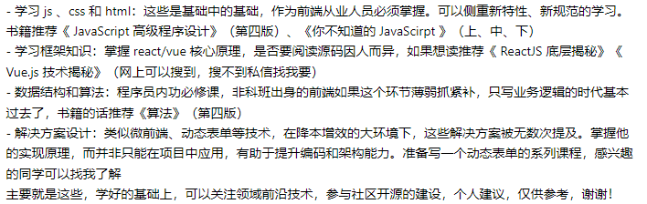

## CI/CD

- 是指持续集成（Continuous Integration, CI）和持续交付/部署（Continuous Delivery/Deployment, CD）的组合，是一种软件工程实践，用于自动化和加速软件开发、测试和发布过程。

1. 前端架构设计

请描述你如何设计一个可扩展的前端架构，并解释你选择的架构模式和组件化策略。

2. 现代 JavaScript 特性

请解释 ES6（ECMAScript 2015）及以上版本中引入的一些新特性，并讨论它们如何改进前端开发。

3. 前端性能优化

描述你如何使用现代工具和方法来分析和优化前端应用的性能。

4. 前端安全最佳实践

讨论前端开发中的一些安全最佳实践，包括但不限于内容安全策略（CSP）、跨站请求伪造（CSRF）防护和跨站脚本（XSS）预防。

5. 前端测试

描述你在前端测试中使用的策略，包括单元测试、集成测试和端到端测试。

6. 前端构建工具

你如何使用构建工具（如 Webpack、Rollup 等）来优化前端开发流程？

7. 前端与后端的交互

描述你在处理 API 请求和响应时的最佳实践，包括错误处理和数据状态管理。

8. 前端状态管理

讨论你使用状态管理库（如 Redux、Vuex 等）的经验，以及在复杂应用中管理状态的策略。

9. 前端新技术和趋势

讨论你最近关注的一些前端新技术或趋势，并解释它们如何影响前端开发。

10. 前端代码质量和维护

描述你如何确保代码质量，包括代码审查、重构和遵循编码标准。

11. 前端项目案例分析

请分享一个你参与的复杂前端项目，并详细说明你在项目中的角色、面临的挑战以及解决方案。

12. 前端跨浏览器兼容性

描述你如何处理不同浏览器和设备上的兼容性问题。

13. 前端团队协作

讨论你在前端团队中如何协作，包括代码共享、知识传递和团队沟通。

14. 前端代码部署和监控

描述你如何部署前端应用，并解释你如何监控应用的性能和用户行为。

15. 前端访问性（Accessibility, a11y）

讨论你对 Web 访问性的理解，以及如何在前端开发中实现它。

