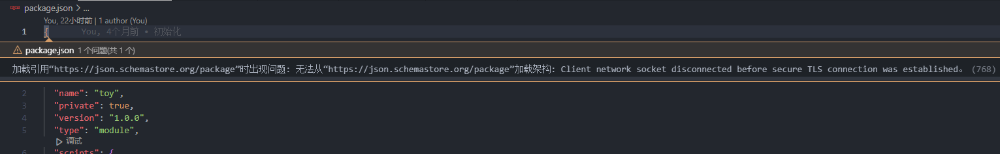
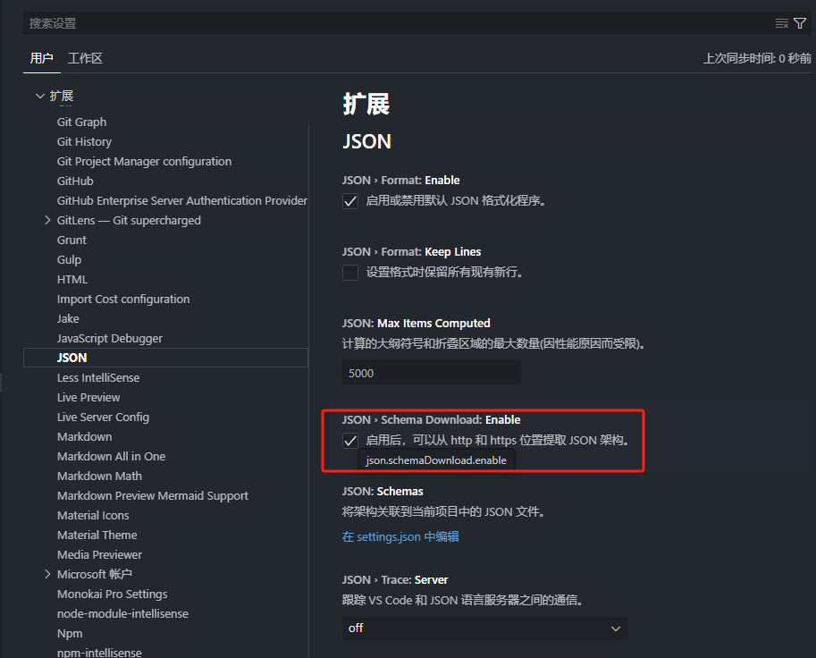

# 问题处理

# error1：

> 加载引用 “https://json.schemastore.org/package” 时出现问题: 无法从“https://json.schemastore.org/package” 加载架构: Client network socket disconnected before secure TLS connection was established

### `success1:`

将该选项的勾选取消即可。

